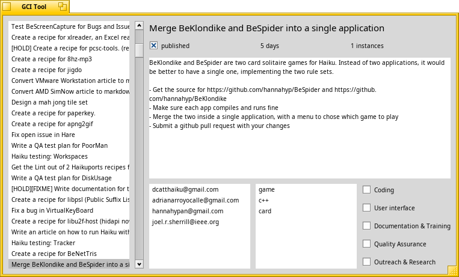

GCITool - Google Code-In task editor
====

This is a tool to manage tasks for the [Google Code-In](codein.withgoogle.com).

GCI is a contest for 13-17 year old which involves contributing to open source
projects by completing pre-defined tasks.

The goal of this little editor is to make it easy to edit the tasks descriptions
and titles, define new tasks, assign mentors, etc, and then upload everything
in one go to the GCI website where the contest is run.

In the past, we have used a mix of wiki pages and manual uploading to the site,
but that is a lot of work and should be automated.

Since we are lazy and late, the idea is to put the sourcecode for this in the
hands of our GCI student and let them add the functionality for us.

By the way, here is a screenshot (yes, the app looks ugly):

